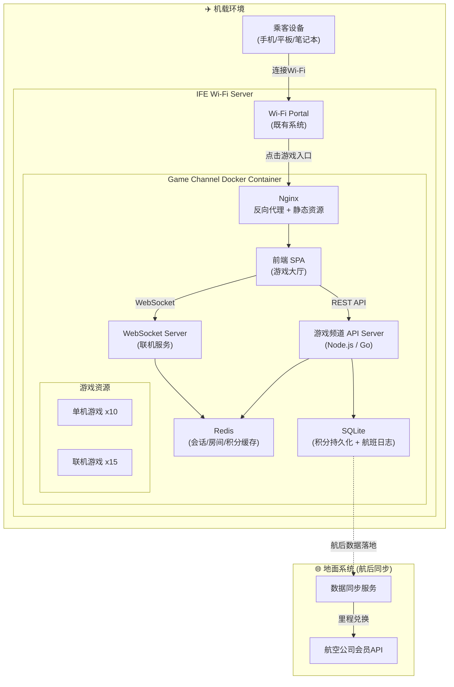
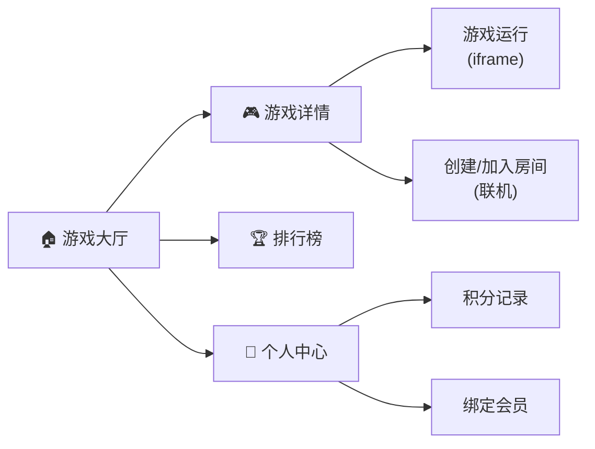
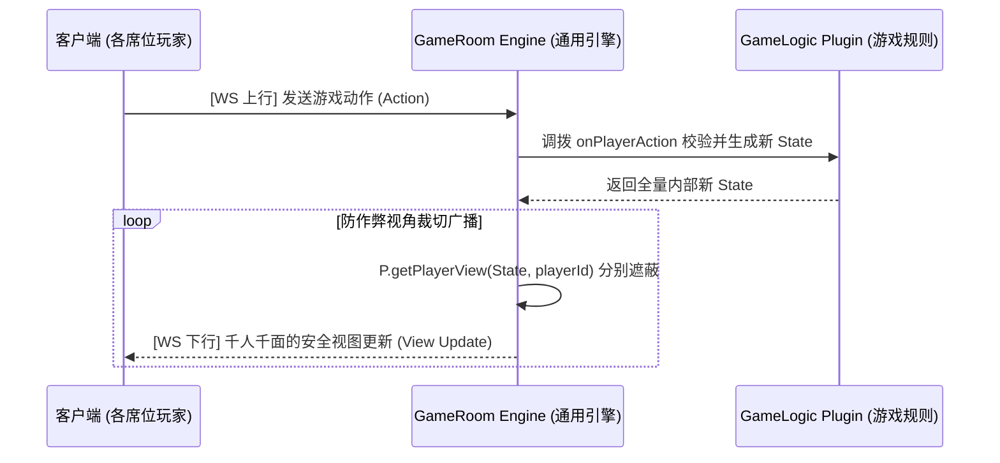
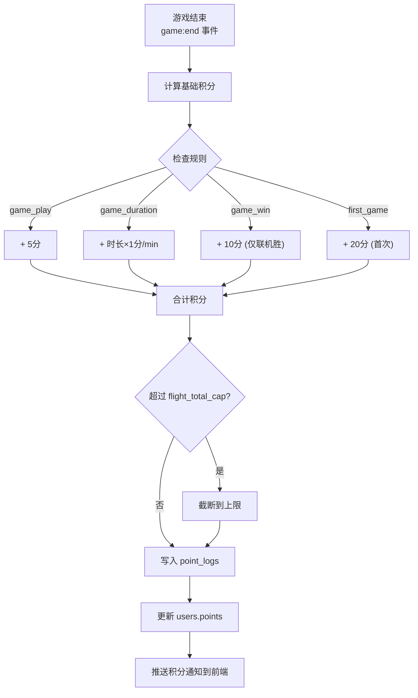
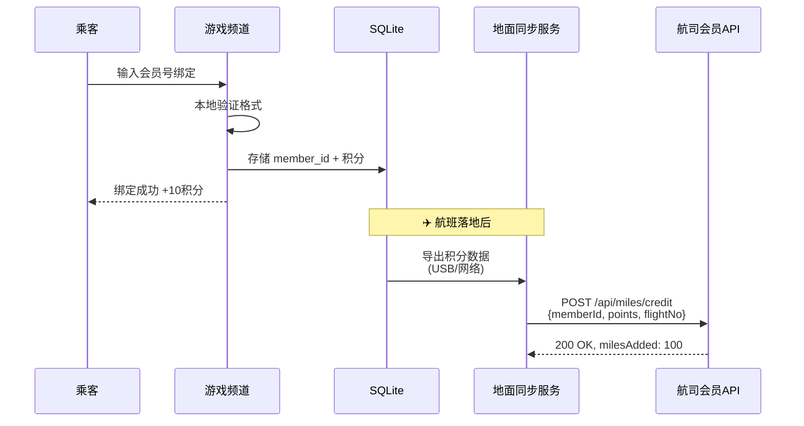
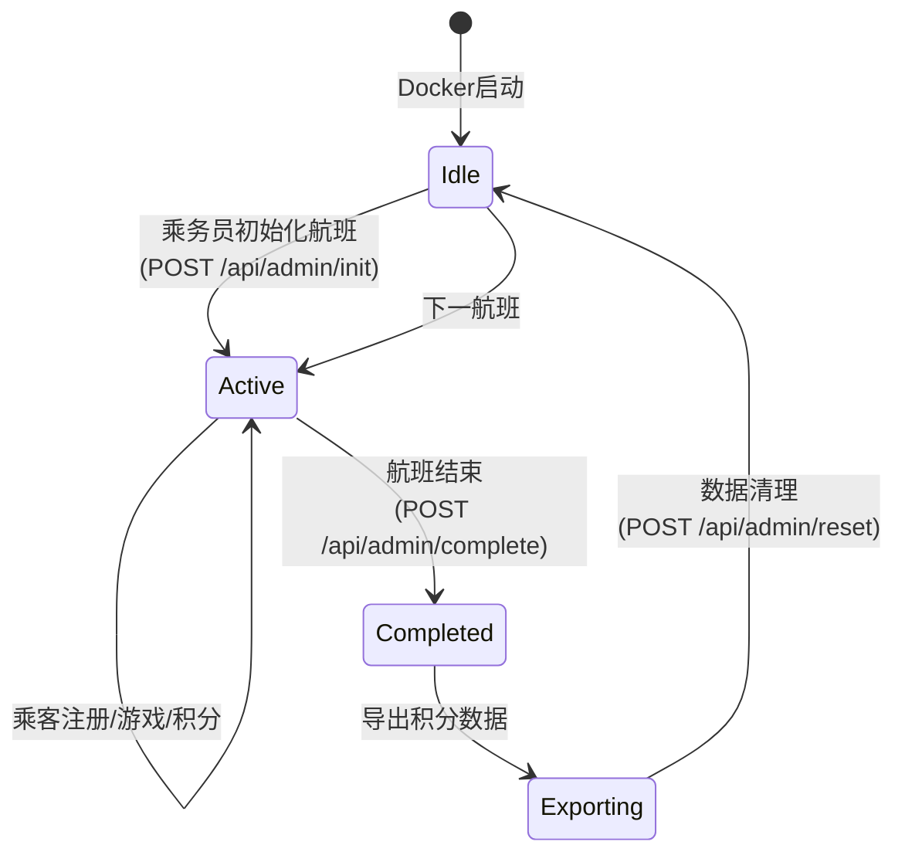

# IFE Wi-Fi 游戏频道 — 技术设计方案

## 1. 系统全景



## 2. Docker 部署架构

### 2.1 容器组成

采用**单容器多进程**方案（`supervisord` 编排），适合机载离线环境，避免 docker-compose 复杂度：

```
game-channel:latest
├── supervisord.conf          # 进程管理
├── /app/nginx/               # Nginx (端口 80/443)
├── /app/server/              # API + WebSocket Server
├── /app/frontend/dist/       # 前端构建产物
├── /app/games/
│   ├── solo/                 # 单机游戏 (各自独立目录)
│   │   ├── tetris/
│   │   ├── 2048/
│   │   └── ...
│   └── multiplayer/          # 联机游戏
│       ├── doudizhu/
│       ├── chess/
│       └── ...
├── /app/data/                # SQLite + 日志 (volume mount)
└── /app/config/              # 可配置项 (volume mount)
    ├── games.json            # 游戏注册表
    ├── points.json           # 积分规则
    └── airline.json          # 航司对接配置
```

### 2.2 Docker 运行参数

```bash
docker run -d \
  --name game-channel \
  --restart always \
  -p 8080:80 \
  -v /data/game-channel/data:/app/data \
  -v /data/game-channel/config:/app/config \
  game-channel:latest
```

### 2.3 Wi-Fi Portal 集成

Wi-Fi Portal 侧只需添加一个入口链接：

```html
<!-- Wi-Fi Portal 中嵌入 -->
<a href="http://<server-ip>:8080" target="_blank" class="game-channel-entry">
  🎮 游戏频道
</a>
```

或通过 iframe 嵌入：

```html
<iframe src="http://<server-ip>:8080" style="width:100%;height:100%;border:none;"></iframe>
```

> **💡 推荐 iframe 方案**，用户体验更无缝，Portal 可传递用户标识（如 seat ID、session token）。

---

## 3. 前端架构

### 3.1 技术选型

| 项目 | 选型 | 理由 |
|------|------|------|
| 框架 | **Vue 3 + Vite** | 轻量、构建快、移动端适配好 |
| UI | **自研组件 + CSS Variables** | 离线环境不依赖CDN |
| 状态管理 | **Pinia** | Vue 3 官方推荐 |
| WebSocket | **Socket.IO Client** | 自动重连、房间管理 |
| 游戏容器 | **iframe sandbox** | 隔离游戏运行环境 |

### 3.2 页面结构



### 3.3 游戏大厅 UI 布局

```
┌─────────────────────────────────────────────┐
│  🎮 飞行游戏频道          [积分: 120] [👤]  │
├─────────────────────────────────────────────┤
│  [全部] [单机] [联机·在线3人]  🔍            │
├─────────────────────────────────────────────┤
│  ┌─────┐ ┌─────┐ ┌─────┐ ┌─────┐          │
│  │     │ │     │ │     │ │     │          │
│  │ 2048│ │俄罗斯│ │斗地主│ │象棋 │          │
│  │     │ │方块  │ │🟢 3人│ │🟢 1人│          │
│  └─────┘ └─────┘ └─────┘ └─────┘          │
│  ┌─────┐ ┌─────┐ ┌─────┐ ┌─────┐          │
│  │     │ │     │ │     │ │     │          │
│  │扫雷 │ │五子棋│ │ UNO │ │跳棋 │          │
│  │     │ │🟢 0人│ │🟢 2人│ │🟢 0人│          │
│  └─────┘ └─────┘ └─────┘ └─────┘          │
└─────────────────────────────────────────────┘
```

### 3.4 游戏集成协议 (Game SDK)

每款游戏通过 iframe 加载，与宿主页面通过 `postMessage` 通信：

```typescript
// Game SDK - 游戏侧引入
interface GameChannelSDK {
  // 游戏 → 大厅
  reportReady(): void;                    // 游戏加载完成
  reportScore(score: number): void;       // 上报分数
  reportGameEnd(result: GameResult): void;// 游戏结束

  // 大厅 → 游戏 (联机)
  onPlayerJoin(callback: (player: Player) => void): void;
  onPlayerLeave(callback: (playerId: string) => void): void;
  onGameAction(callback: (action: GameAction) => void): void;
  sendGameAction(action: GameAction): void;
}

// 游戏注册 manifest (每个游戏目录下的 game.json)
interface GameManifest {
  id: string;              // "doudizhu"
  name: string;            // "斗地主"
  type: "solo" | "multiplayer";
  minPlayers?: number;     // 联机最少人数
  maxPlayers?: number;     // 联机最多人数
  entry: string;           // "index.html"
  icon: string;            // "icon.png"
  description: string;
  version: string;
  tags: string[];          // ["棋牌", "策略"]
}
```

---

## 4. 后端架构

### 4.1 技术选型

| 项目 | 选型 | 理由 |
|------|------|------|
| Runtime | **Node.js 20 LTS** | 生态丰富、WebSocket 原生支持 |
| HTTP框架 | **Fastify** | 比Express快、Schema验证内置 |
| WebSocket | **Socket.IO** | 房间管理、断线重连、命名空间 |
| 数据库 | **SQLite (better-sqlite3)** | 零依赖、机载环境可靠 |
| 缓存 | **内存Map/LRU** | 替代Redis，单容器无需IPC |
| 进程管理 | **PM2** | 自动重启、日志管理 |

> **📝 注意**：机载环境为离线局域网，并发量有限（通常 < 200 设备），Node.js 单进程足以支撑。

### 4.2 API 设计

```yaml
# 游戏管理
GET    /api/games                    # 获取游戏列表
GET    /api/games/:id                # 获取游戏详情
GET    /api/games/:id/leaderboard    # 游戏排行榜

# 用户 (基于设备指纹 + 座位号的轻量身份)
POST   /api/user/register            # 注册临时用户 {nickname, seatNo?}
GET    /api/user/profile              # 获取用户信息 + 积分
POST   /api/user/bindMember          # 绑定航司会员

# 联机
GET    /api/rooms                     # 获取房间列表 (按游戏筛选)
POST   /api/rooms                     # 创建房间
POST   /api/rooms/:id/join           # 加入房间
DELETE /api/rooms/:id/leave          # 离开房间

# 积分
GET    /api/points/history           # 积分历史
GET    /api/points/rules             # 积分规则说明
POST   /api/points/redeem            # 积分兑换 (预留)

# 管理 (航班乘务端)
GET    /api/admin/stats              # 航班游戏统计
POST   /api/admin/reset              # 航班重置 (新航班)
GET    /api/admin/export             # 导出数据
```

### 4.3 数据模型

```sql
-- 用户表 (每航班临时)
CREATE TABLE users (
  id          TEXT PRIMARY KEY,        -- UUID
  nickname    TEXT NOT NULL,
  seat_no     TEXT,
  device_fp   TEXT,                    -- 设备指纹
  member_id   TEXT,                    -- 航司会员ID (可选)
  points      INTEGER DEFAULT 0,
  created_at  DATETIME DEFAULT CURRENT_TIMESTAMP
);

-- 游戏记录
CREATE TABLE game_sessions (
  id          TEXT PRIMARY KEY,
  user_id     TEXT NOT NULL,
  game_id     TEXT NOT NULL,           -- 对应 game.json 的 id
  type        TEXT NOT NULL,           -- solo / multiplayer
  room_id     TEXT,                    -- 联机房间ID
  score       INTEGER,
  result      TEXT,                    -- win / lose / draw / completed
  duration    INTEGER,                 -- 游戏时长(秒)
  points_earned INTEGER DEFAULT 0,
  started_at  DATETIME,
  ended_at    DATETIME,
  FOREIGN KEY (user_id) REFERENCES users(id)
);

-- 积分流水
CREATE TABLE point_logs (
  id          TEXT PRIMARY KEY,
  user_id     TEXT NOT NULL,
  amount      INTEGER NOT NULL,        -- 正数获得，负数消耗
  reason      TEXT NOT NULL,           -- game_play / game_win / member_bind
  ref_id      TEXT,                    -- 关联的 game_session id
  created_at  DATETIME DEFAULT CURRENT_TIMESTAMP,
  FOREIGN KEY (user_id) REFERENCES users(id)
);

-- 航班信息
CREATE TABLE flight_info (
  id          TEXT PRIMARY KEY,
  flight_no   TEXT,
  departure   TEXT,
  arrival     TEXT,
  date        TEXT,
  status      TEXT DEFAULT 'active',   -- active / completed
  created_at  DATETIME DEFAULT CURRENT_TIMESTAMP
);
```

---

## 5. 联机服务设计（概要）

> ⚠️ **完整技术细节见设计专篇 → [联机游戏模块详细设计](./联机游戏模块_详细设计.md)**
>
> 内含完整深入的技术规范：房间与席位状态机、服务端权威与校验机制、断线托管重连策略、接口协议详情。

### 5.1 核心架构：单一引擎 + 可插拔规则 (Engine + Plugin)

为适应机载离线环境（局域网隔离、并发有限、极简部署），系统摒弃了传统“每款联机游戏跑一个独立进程”的做法，采用**“单进程通用状态机引擎 + 面向接口的游戏逻辑插件”**的创新架构设计。

**三层核心模块职责**：
1. **Gateway**：唯一外部网络边界，维持 WebSocket 长连接、鉴权与弱网跌落判定。
2. **GameRoom Engine**：系统底层基座，跨游戏通用。剥离并处理所有房局生命周期、席位逻辑及通用倒计时触发。
3. **GameLogic Plugin**：各款联机游戏的独立玩法“黑盒”。通过实现统一接口规范，只负责纯函数校验（Action -> State）及安全视角的裁剪运算。

### 5.2 架构核心价值
- **轻量部署**：只需拉起单个 Node.js 进程实例跑满 15 款联机游戏，单进程内存利用率高。
- **高能复用**：诸如“网络切后台断连托管”、“重连补发全量快照”等棘手业务，从具体游戏中全数剥离交由引擎统一兜底。
- **降本增效**：后续扩展新游戏，仅需关注内部玩法与前端渲染对接，零心智负担对接网络同步层。

### 5.3 抽象工作流水线



---

## 6. 积分系统

### 6.1 积分规则配置 (`/app/config/points.json`)

```json
{
  "version": "1.0",
  "rules": {
    "game_play": {
      "description": "每完成一局游戏",
      "points": 5,
      "cooldown_minutes": 0,
      "daily_cap": 100
    },
    "game_duration": {
      "description": "游戏时长奖励",
      "points_per_minute": 1,
      "min_duration_minutes": 2,
      "max_points_per_session": 30
    },
    "game_win": {
      "description": "联机游戏获胜",
      "points": 10
    },
    "first_game": {
      "description": "首次游戏奖励",
      "points": 20,
      "once_per_flight": true
    },
    "member_bind": {
      "description": "绑定航司会员",
      "points": 10,
      "once_per_flight": true
    },
    "play_n_games": {
      "description": "玩满N款不同游戏",
      "thresholds": [
        { "games": 3, "points": 15 },
        { "games": 5, "points": 30 },
        { "games": 10, "points": 50 }
      ]
    }
  },
  "flight_total_cap": 500
}
```

### 6.2 积分计算流程



---

## 7. 航司会员对接

### 7.1 对接模式

> ⚠️ **重要**：机载环境通常**无公网连接**，会员对接采用**航后异步同步**的模式。



### 7.2 数据导出格式

```json
{
  "flight": {
    "flight_no": "CA1234",
    "date": "2026-04-13",
    "departure": "PEK",
    "arrival": "SHA"
  },
  "member_credits": [
    {
      "member_id": "CA88812345678",
      "total_points": 85,
      "games_played": 7,
      "play_duration_minutes": 42,
      "details": [
        {"game": "doudizhu", "points": 25, "wins": 2},
        {"game": "2048", "points": 15, "duration_min": 12}
      ]
    }
  ],
  "conversion_rule": {
    "points_per_mile": 10,
    "min_points": 10
  }
}
```

### 7.3 航司对接接口 (地面侧)

```typescript
// 航司需要提供的 API (或我们适配)
interface AirlineMemberAPI {
  // 验证会员 (如有空对地连接可实时)
  validateMember(memberId: string): Promise<{valid: boolean, name?: string}>;

  // 积分兑换里程 (航后批量)
  creditMiles(batch: MileCreditRequest[]): Promise<MileCreditResponse[]>;
}

interface MileCreditRequest {
  memberId: string;
  flightNo: string;
  flightDate: string;
  gamePoints: number;
  convertedMiles: number;
  details: GamePlaySummary[];
}
```

---

## 8. 游戏扩展机制

### 8.1 添加新游戏流程

```
1. 开发游戏 → 引入 Game SDK → 输出为独立目录
2. 创建 game.json manifest
3. 放入 /app/games/solo/ 或 /app/games/multiplayer/
4. 联机游戏：额外实现 GameLogicPlugin 接口
5. 重建 Docker 镜像 (或热加载目录)
6. 服务启动时扫描 games/ 目录注册游戏 + 加载插件
```

### 8.2 游戏注册表（自动生成）

服务启动时扫描 `/app/games/` 目录下所有 `game.json`，生成运行时游戏注册表：

```typescript
async function scanGames(gamesDir: string): Promise<GameManifest[]> {
  const games: GameManifest[] = [];
  for (const type of ['solo', 'multiplayer']) {
    const dir = path.join(gamesDir, type);
    for (const entry of await fs.readdir(dir, { withFileTypes: true })) {
      if (entry.isDirectory()) {
        const manifest = JSON.parse(
          await fs.readFile(path.join(dir, entry.name, 'game.json'), 'utf-8')
        );
        manifest.type = type;
        manifest.basePath = `/games/${type}/${entry.name}/`;
        games.push(manifest);
      }
    }
  }
  return games;
}
```

---

## 9. 推荐游戏清单

### 9.1 单机游戏 (10款)

| # | 游戏 | 技术方案 | 复杂度 |
|---|------|----------|--------|
| 1 | 2048 | Canvas/DOM | ★☆☆ |
| 2 | 俄罗斯方块 | Canvas | ★★☆ |
| 3 | 扫雷 | DOM | ★☆☆ |
| 4 | 贪吃蛇 | Canvas | ★☆☆ |
| 5 | 消消乐(三消) | Canvas/PixiJS | ★★★ |
| 6 | 数独 | DOM | ★★☆ |
| 7 | 接水果 | Canvas | ★★☆ |
| 8 | 拼图 | DOM + Drag API | ★★☆ |
| 9 | 打砖块 | Canvas | ★★☆ |
| 10 | 成语接龙 | DOM | ★★☆ |

### 9.2 联机游戏 (15款)

| # | 游戏 | 人数 | 权威模式 | Plugin 复杂度 |
|---|------|------|---------|-------------|
| 1 | 斗地主 | 3人 | 服务端权威 | ★★★ |
| 2 | 中国象棋 | 2人 | 服务端权威 | ★★★ |
| 3 | 五子棋 | 2人 | 服务端验证 | ★★☆ |
| 4 | 围棋 | 2人 | 服务端验证 | ★★☆ |
| 5 | UNO | 2-4人 | 服务端权威 | ★★★ |
| 6 | 军棋 | 2人 | 服务端权威 | ★★★ |
| 7 | 飞行棋 | 2-4人 | 服务端权威 | ★★☆ |
| 8 | 跳棋 | 2-6人 | 服务端验证 | ★★☆ |
| 9 | 黑白棋 | 2人 | 服务端验证 | ★★☆ |
| 10 | 德州扑克 | 2-6人 | 服务端权威 | ★★★ |
| 11 | 掼蛋 | 4人 | 服务端权威 | ★★★ |
| 12 | 麻将 | 4人 | 服务端权威 | ★★★ |
| 13 | 井字棋 | 2人 | 服务端验证 | ★☆☆ |
| 14 | 翻牌配对 | 2人 | 服务端验证 | ★☆☆ |
| 15 | 画画猜词 | 3-8人 | 服务端权威 | ★★★ |

> **📝 "服务端权威"**：有隐藏信息（手牌等），状态完全由服务端控制，客户端只收到自己可见的视图。
> **"服务端验证"**：信息完全公开（棋盘等），客户端提交动作，服务端验证合法性后广播。

---

## 10. 航班生命周期管理



每次航班结束时：
1. 标记航班状态为 `completed`
2. 导出积分数据 JSON → `/app/data/exports/CA1234_20260413.json`
3. 清除用户和游戏数据，准备下一航班

---

## 11. 安全与性能考量

### 安全
- **无公网环境**：天然隔离，主要防局域网攻击
- **用户身份**：设备指纹 + 昵称，不收集个人信息
- **游戏 iframe sandbox**：`sandbox="allow-scripts allow-same-origin"` 隔离游戏代码
- **API 限流**：防止单设备恶意刷积分
- **会员号脱敏**：本地仅存哈希，导出时再关联

### 性能
- **静态资源**：Nginx gzip + 强缓存，游戏资源 `Cache-Control: max-age=86400`
- **WebSocket**：心跳检测 30s，超时 60s 断开
- **SQLite WAL模式**：并发读写不阻塞
- **总容器体积**：目标 < 500MB (含所有游戏)

---

## 12. 技术栈汇总

```
┌──────────────────────────────────────────────────┐
│                 Game Channel Docker               │
├──────────────┬──────────────┬────────────────────┤
│   Frontend   │   Backend    │   Infrastructure   │
├──────────────┼──────────────┼────────────────────┤
│ Vue 3        │ Node.js 20   │ Docker (Alpine)    │
│ Vite         │ Fastify      │ Nginx              │
│ Pinia        │ Socket.IO    │ Supervisord        │
│ Socket.IO    │ better-sqlite3│ PM2               │
│ HTML5 Canvas │ zod (验证)    │ SQLite             │
│              │              │                    │
│ Game SDK     │ GameLogic    │ Volume Mounts      │
│ (postMessage)│ Plugins      │ (data + config)    │
└──────────────┴──────────────┴────────────────────┘
```
