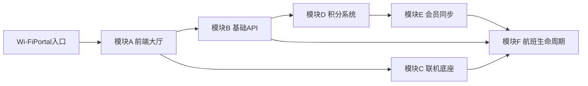

# 架构总览

## 1. 项目目标

构建机载 IFE Wi-Fi 内可离线运行的游戏频道，支持：
- 游戏大厅与统一入口
- 单机与联机游戏
- 航中积分累计与会员绑定
- 航后数据导出与里程同步

## 2. 场景边界

- 运行环境：机载局域网，通常无公网。
- 并发规模：常规 50-200 设备。
- 部署约束：单容器、低依赖、可快速恢复。
- 数据边界：以航班为单位隔离与清理。

## 3. 统一架构口径（已定版）

- 缓存方案：`内存 Map/LRU`，不引入 Redis。
- 进程编排：`PM2` 统一管理 API 与 WebSocket 进程；Nginx 独立前置。
- 身份体系：设备指纹 + 会话令牌 + 可选座位号。
- 隐私策略：会员号本地仅存哈希；明文仅在用户输入时短暂存在于内存处理链路。

## 4. 系统模块地图

## 5. 文档权威来源（SSOT）

- 架构与边界：本文档
- 联机机制：`docs/02-模块设计/联机引擎.md`
- 积分规则：`docs/02-模块设计/积分系统.md`
- 会员同步：`docs/02-模块设计/会员同步.md`
- 接口契约：`docs/03-接口契约.md`
- 数据字典：`docs/04-数据模型与字典.md`
- 测试验收：`docs/05-测试与验收.md`
- 部署运维：`docs/06-部署与运维.md`

## 6. 非功能目标

- 可用性：航中业务连续可用，核心流程可恢复。
- 可靠性：断线重连恢复时间 <= 3 秒（网络恢复后）。
- 安全性：服务端校验关键动作，防作弊与审计留痕。
- 性能：API P95 < 200ms，房间状态广播在 200 并发下稳定。
