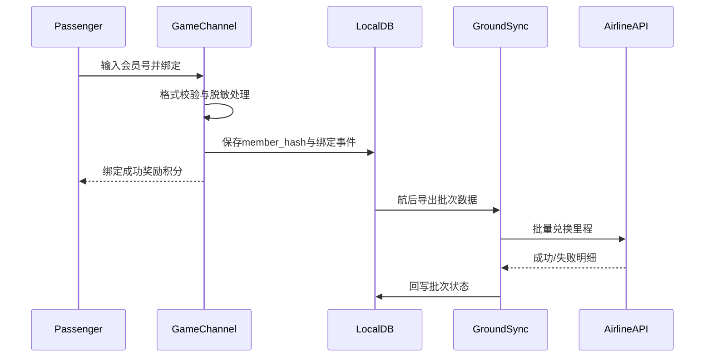

# 模块E：会员绑定与航后同步

## 1. 目标

在无公网机载环境中完成会员绑定记录，并在航后进行批量里程兑换。

## 2. 处理原则

- 航中只做本地校验与记录，不依赖外部网络。
- 会员号不落地明文，存储哈希与脱敏展示值。
- 航后导出数据必须可审计、可重试、可追踪。

## 3. 业务流程

## 4. 导出与对账

- 导出格式包含：航班信息、用户映射ID、总积分、兑换里程、明细。
- 每个导出批次生成 `batch_id`，支持重试与去重。
- 对账标准：总积分、总里程、失败记录三类统计一致。
- 当前接口：`GET /api/v1/admin/flight/export/data?batchId=`（按批次查询导出明细）
- 当前接口：`GET /api/v1/admin/flight/export/batches?flightId=`（查询批次状态）
- 当前接口：`POST /api/v1/admin/flight/export/report`（回写 `success|failed|partial`）

## 5. 异常处理

- 航后同步失败时保留批次状态 `FAILED`，允许手工重试。
- 重试必须携带同一 `batch_id`，避免重复入账。
- 对于接口部分成功，按记录级状态重试失败子集。
