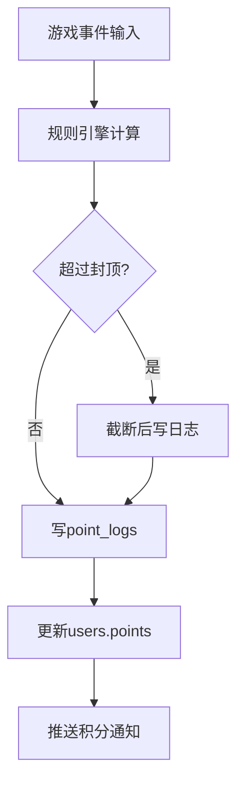

# 模块D：积分系统设计

## 1. 目标

建立航中可离线运行的积分规则引擎，保证可解释、可追溯、可封顶。

## 2. 规则来源

- 配置文件：`/app/config/points.json`
- 规则版本：每次变更必须更新 `version`
- 规则生效：以“航班初始化时加载的版本”为准，航中不热切换

## 3. 计分流程

## 4. 一致性要求

- 积分流水是唯一记账依据，`users.points` 为汇总冗余字段。
- 所有加分动作必须写入 `point_logs`，禁止仅更新总分。
- 同一会话重复结算应幂等（按 `sessionId + reason` 去重）。

## 5. 风控规则

- 单局、单日、全航班封顶并存，以最小上限生效。
- 高频触发同类事件启用节流（如短时重复上报）。
- 检测异常行为（超常速刷分）并记录风控标签。

## 6. 对外接口

- 查询：积分历史、当前积分、规则说明
- 写入：游戏结束事件、会员绑定奖励、运营补发（管理端）

## 7. 验收口径

- 与 `point_logs` 对账误差为 0
- 全量回放同一批事件，结果一致
- 封顶策略在边界值场景下正确生效
