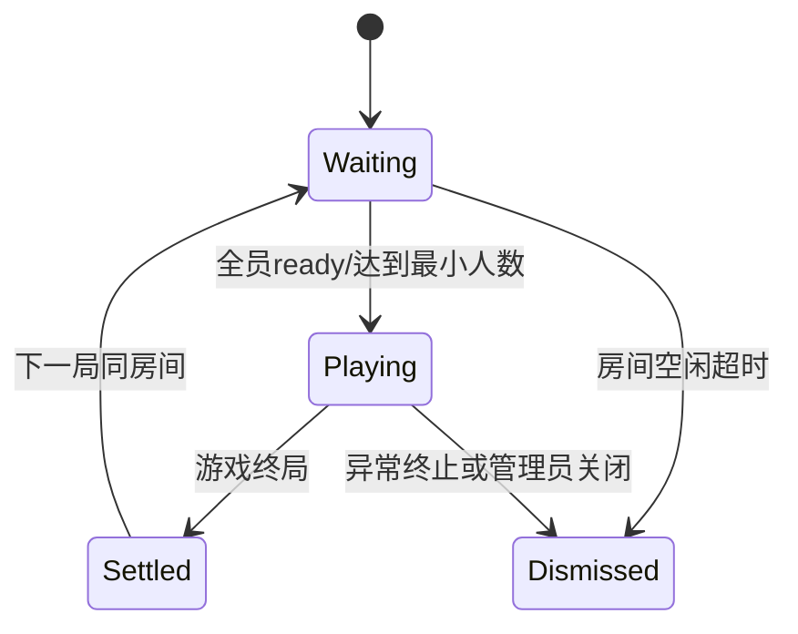

# 模块C：联机引擎设计

## 1. 目标与职责

联机引擎负责跨游戏复用的实时能力：
- 连接鉴权、会话管理、路由分发
- 房间生命周期与席位管理
- 回合推进、超时处理、断线托管、重连恢复
- 插件调度与玩家视角裁剪

## 2. 组件边界

- `Gateway`：WebSocket 接入层，处理鉴权、心跳与连接状态。
- `RoomEngine`：房间状态机，管理 WAITING/PLAYING/SETTLED/DISMISSED。
- `GameLogicPlugin`：规则插件，定义 `onGameStart/onPlayerAction/getPlayerView/isGameOver`。

## 3. 状态机定义

## 4. 协议与幂等要求

- WebSocket 握手必须携带 `auth.playerId` 与 `auth.token`，当前开发桩校验规则为 `token = dev_<playerId>`。
- `room:join` 对同一 `playerId + roomId` 幂等，重复请求仅刷新会话，不重置 `ready` 状态。
- 所有 `game:action` 必须携带 `actionId` 和 `clientTs`。
- 服务端按 `(roomId, playerId, actionId)` 去重，重复请求返回同一处理结果。
- 广播消息携带 `stateVersion`，客户端仅接受新版本或触发全量同步。

## 5. 断线重连策略

- 心跳：30 秒，超时 60 秒判定断线。
- 断线进入 `OFFLINE`，保留席位 120 秒。
- 轮到离线玩家时执行插件 `fallbackAction`。
- 重连成功后，服务端下发 `sync_full`（含当前可见视图与版本号）。
- 对局结束后，房间进入 `SETTLED`；全员再次 `ready` 后开启下一局。

## 6. 安全与防作弊

- 隐藏信息游戏强制服务端权威，客户端仅渲染视图。
- 明牌游戏允许客户端先行动画，但以服务端裁定为准。
- 非法动作记录审计日志：`playerId/gameId/roomId/action/error`。

## 7. MVP 范围

- 首批接入两款联机样例：
  - 权威模型：斗地主（隐藏信息，最小手牌出完可结算）
  - 校验模型：五子棋（明牌信息，五连子或满盘可结算）
