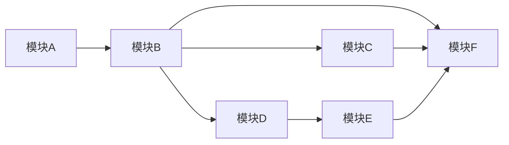

# 模块化开发计划

## 1. 模块拆分

- 模块A：入口与前端大厅
- 模块B：后端基础 API
- 模块C：联机底座（Gateway + RoomEngine + Plugin）
- 模块D：积分系统
- 模块E：会员绑定与航后同步
- 模块F：运维与航班生命周期

## 2. 依赖关系

## 3. 里程碑

### M0（1周）：文档定版
- 交付：架构总览、模块设计、契约、数据字典、测试运维、ADR
- 验收：关键冲突全部闭环并评审通过

### M1（2-3周）：MVP 主链路
- 范围：A + B + D + F
- 验收：可完成“进大厅 -> 单机 -> 记分 -> 航后导出”

### M2（2-4周）：联机能力
- 范围：C（首批2款联机样例）
- 验收：建房/对局/断线重连/结算稳定

### M3（1-2周）：会员闭环
- 范围：E + 统计报表优化
- 验收：批量同步可追溯可重试，账目可对账

## 4. 每模块 DoD

- 功能通过核心验收用例
- 接口契约与实现一致
- 关键日志与错误码齐全
- 测试覆盖关键主流程和异常流程
- 文档更新到最新版本

## 5. 当前进度（2026-04-15）

- 模块A：未启动
- 模块B：已完成 MVP（REST API + 单元/集成测试）
- 模块C：已完成当前迭代（幂等修复、会话接管、空闲房间回收）
- 模块D：已完成 MVP（积分规则加载、积分流水、封顶与幂等、管理端补发）
- 模块E：进行中（已实现按 `batchId` 查询会员同步导出明细）
- 模块F：进行中（已实现 reset 航班级缓存清理与运维校验）

下一优先级建议：
1. 模块F（航班生命周期）持久化与导出任务化
2. 模块E（会员同步）打通地面回写（SUCCESS/FAILED/PARTIAL）闭环
3. 模块A（前端大厅）接入模块B/C/D/F 实际接口

## 6. 进度记录（提交追踪）

- 2026-04-15：`a3f4d26`，模块C第二阶段（`room:leave`、`game:over`、鉴权桩、测试）
- 2026-04-15：`9026442`，模块C第三阶段（`sync_full`、版本保护、审计日志、压测脚本）
- 2026-04-15：`54cf01f`，模块B MVP（REST API + 测试 + 文档）
- 2026-04-15：`4242bee`，模块D MVP（积分规则、流水、封顶、幂等、管理端补发）

对应 issue 进展评论：
- 模块B：<https://github.com/Odemwingy/Game_Channel_0414/issues/2#issuecomment-4251207999>
- 模块C：<https://github.com/Odemwingy/Game_Channel_0414/issues/3#issuecomment-4250041073>
- 模块D：<https://github.com/Odemwingy/Game_Channel_0414/issues/4#issuecomment-4251254747>
