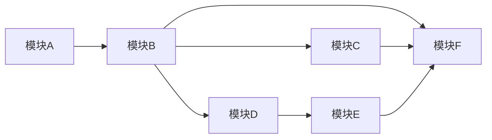

# 模块化开发计划

## 1. 模块拆分

- 模块A：入口与前端大厅
- 模块B：后端基础 API
- 模块C：联机底座（Gateway + RoomEngine + Plugin）
- 模块D：积分系统
- 模块E：会员绑定与航后同步
- 模块F：运维与航班生命周期

## 2. 依赖关系

## 3. 里程碑

### M0（1周）：文档定版
- 交付：架构总览、模块设计、契约、数据字典、测试运维、ADR
- 验收：关键冲突全部闭环并评审通过

### M1（2-3周）：MVP 主链路
- 范围：A + B + D + F
- 验收：可完成“进大厅 -> 单机 -> 记分 -> 航后导出”

### M2（2-4周）：联机能力
- 范围：C（首批2款联机样例）
- 验收：建房/对局/断线重连/结算稳定

### M3（1-2周）：会员闭环
- 范围：E + 统计报表优化
- 验收：批量同步可追溯可重试，账目可对账

## 4. 每模块 DoD

- 功能通过核心验收用例
- 接口契约与实现一致
- 关键日志与错误码齐全
- 测试覆盖关键主流程和异常流程
- 文档更新到最新版本

## 5. 当前进度（2026-04-16）

- 模块A：未启动（等待后端与联机接口稳定后联调）
- 模块B：已完成 MVP（REST API + 单元/集成测试）
- 模块C：已完成当前阶段，review 反馈的两条 P2 已闭环（`room:join` 幂等、空闲房间超时与回收）
- 模块D：已完成 MVP（积分规则加载、积分流水、封顶与幂等、管理端补发）
- 模块E：进行中（已实现导出明细查询、批次状态查询、地面回写接口；待任务化重试）
- 模块F：进行中（已实现 reset 航班级缓存清理；待生命周期持久化与运维指标沉淀）

下一优先级建议：
1. 模块F：实现航班生命周期持久化（`init/complete/export/reset`）与导出任务化
2. 模块E：实现同步任务执行器（重试/回退/终态判定）并输出对账报告
3. 模块A：前端大厅接入模块B/C/D/F真实接口，完成“进大厅 -> 建/入房 -> 对局 -> 积分/航后”链路验收

## 6. 进度记录（提交追踪）

- 2026-04-16：`9abf503`，模块C回归测试加固（空闲房间回收与内存增长风险覆盖）
- 2026-04-16：`a139f56`，模块E批次状态查询与地面回写接口
- 2026-04-16：`ca46aa4`，模块E导出明细接口（按 `batchId` 查询同步载荷）
- 2026-04-16：`273823e`，模块F航班 reset 缓存清理与回归测试
- 2026-04-15：`2f238aa`，模块C空闲房间超时回收、定时事件补发、状态机收口
- 2026-04-15：`20440b4`，模块C会话接管与 join 幂等语义修复
- 2026-04-15：`54cf01f`，模块B MVP（REST API + 测试 + 文档）
- 2026-04-15：`4242bee`，模块D MVP（积分规则、流水、封顶、幂等、管理端补发）
- 2026-04-15：`4479045`，文档进度与 issue 链接更新

对应 issue 进展评论：
- 模块B：<https://github.com/Odemwingy/Game_Channel_0414/issues/2#issuecomment-4251207999>
- 模块C：<https://github.com/Odemwingy/Game_Channel_0414/issues/3#issuecomment-4251021911>
- 模块D：<https://github.com/Odemwingy/Game_Channel_0414/issues/4#issuecomment-4251254747>
- 模块E：<https://github.com/Odemwingy/Game_Channel_0414/issues/5#issuecomment-4256918867>
- 模块F：<https://github.com/Odemwingy/Game_Channel_0414/issues/6#issuecomment-4256633086>

## 7. 剩余功能与建议排期

短期（本周）：
1. 模块F：落地生命周期持久化存储与状态迁移守卫，防止进程重启后状态丢失
2. 模块E：新增同步任务执行器（`PENDING -> SYNCING -> SUCCESS/FAILED/PARTIAL`）与失败重试策略

中期（下周）：
1. 模块A：大厅、个人中心、房间页接入真实 API 与 WebSocket 协议
2. 联调验收：补齐跨模块 e2e 验收脚本（模块A + B + C + D + E + F）
