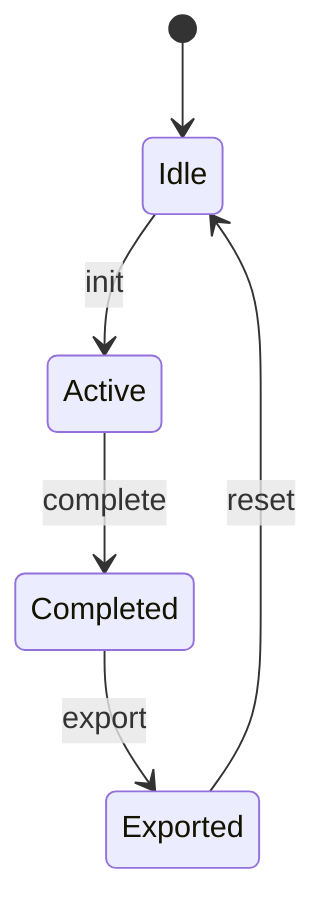

# ADR-004：航班管理接口与状态机

## 状态
已采纳

## 决策
统一航班管理接口为：
- `POST /api/v1/admin/flight/init`
- `POST /api/v1/admin/flight/complete`
- `GET /api/v1/admin/flight/export`
- `POST /api/v1/admin/flight/reset`
- `GET /api/v1/admin/stats`

## 背景
- 现有文档中存在 `/admin/init|complete` 与 `/admin/reset|export|stats` 分散描述。
- 需要形成统一命名与生命周期闭环。

## 状态机

## 影响
- 优点：接口命名一致，便于前后端联调与测试。
- 代价：旧接口命名需兼容期或一次性迁移。

## 落地要求
- 状态转换非法时返回标准错误码。
- 导出仅允许在 `Completed` 及之后执行。
- `reset` 前必须确认导出完成或人工确认跳过。
